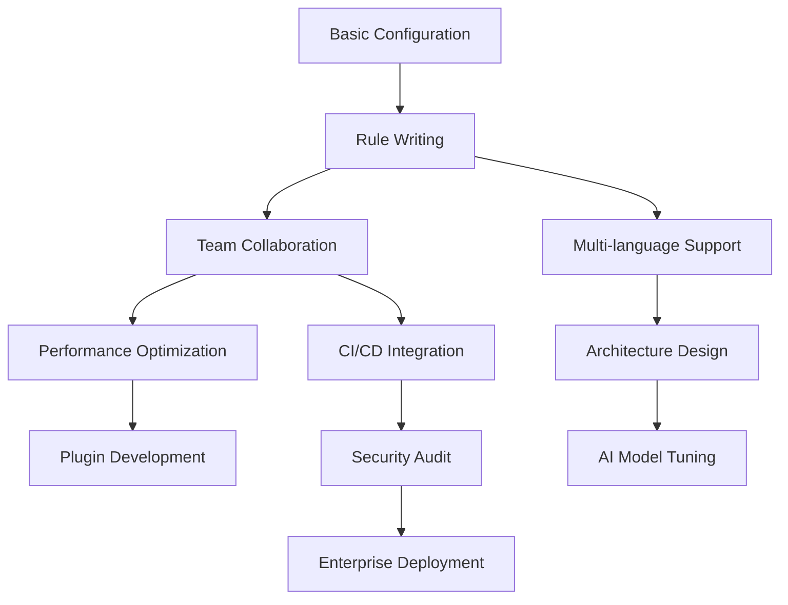
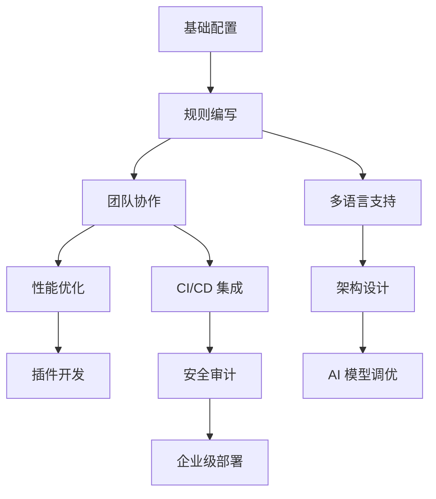

# Cursor Advanced Practice Guide (Extended Edition)
# Cursor 高阶实践指南（扩展版）

> **English**: Advanced extensions based on the official guide, including **practical techniques**, **advanced configurations**, **team collaboration**, and **troubleshooting**.
> 
> **中文**: 基于官方指南的深度扩展，包含**实战技巧**、**进阶配置**、**团队协作**和**故障排除**等核心内容。

---

## 📚 Table of Contents | 目录

**English:**
1. [Official Guide Summary](#official-summary-en)
2. [Advanced Configuration Tips](#advanced-config-en)
3. [Practical Interaction Patterns](#interaction-patterns-en)
4. [Team Collaboration Standards](#team-collaboration-en)
5. [Performance Optimization Strategies](#performance-optimization-en)
6. [Troubleshooting Guide](#troubleshooting-en)
7. [Plugin Ecosystem Integration](#plugin-ecosystem-en)
8. [Continuous Learning Path](#learning-path-en)

**中文:**
1. [官方指南总结](#official-summary-cn)
2. [进阶配置技巧](#advanced-config-cn)
3. [实战交互模式](#interaction-patterns-cn)
4. [团队协作规范](#team-collaboration-cn)
5. [性能优化策略](#performance-optimization-cn)
6. [故障排除指南](#troubleshooting-cn)
7. [插件生态集成](#plugin-ecosystem-cn)
8. [持续学习路径](#learning-path-cn)

---

<a id="official-summary-en"></a>

## 1 | Official Guide Summary

Base rule files configuration completed:
- ✅ `001-base.mdc` - Global coding standards
- ✅ `010-checklist.mdc` - Automatic task checklist
- ✅ `020-safety.mdc` - Basic safety protection
- ✅ `030-test-driven.mdc` - Test-driven development
- ✅ `050-anti-hallucination.mdc` - Advanced hallucination protection
- ✅ `.cursor/config.json` - Core configuration
- ✅ `DEV_CHECKLIST.md` - Development task tracking

<a id="official-summary-cn"></a>

## 1 | 官方指南总结

已完成基础规则文件配置：
- ✅ `001-base.mdc` - 全局编码规范
- ✅ `010-checklist.mdc` - 自动任务清单
- ✅ `020-safety.mdc` - 基础安全防护
- ✅ `030-test-driven.mdc` - 测试驱动开发
- ✅ `050-anti-hallucination.mdc` - 幻觉防护进阶版
- ✅ `.cursor/config.json` - 核心配置
- ✅ `DEV_CHECKLIST.md` - 开发任务追踪

---

<a id="advanced-config-en"></a>

## 2 | Advanced Configuration Tips

### 2.1 Environment-Specific Configuration

```jsonc
// .cursor/environments/development.json
{
  "model": "openai/gpt-4o",
  "temperature": 0.1,  // More conservative in development
  "contextLines": 300,
  "enableDebugMode": true,
  "localLLMEndpoint": "http://localhost:8080/v1" // Optional local model
}

// .cursor/environments/production.json
{
  "model": "anthropic/claude-3-opus",
  "temperature": 0.05,  // Extremely conservative in production
  "contextLines": 150,
  "strictMode": true,
  "requireReview": true
}
```

### 2.2 Language-Specific Rules

```mdc
<!-- .cursor/rules/100-python-specific.mdc -->
---
description: Python-specific coding standards
globs:
  - "**/*.py"
---

## 🐍 Python-Specific Rules
- Mandatory type annotations: `def func(param: str) -> int:`
- Use dataclasses instead of regular classes
- Prefer async/await for asynchronous functions
- Import order: standard library → third-party → local modules
- Docstrings must follow Google Style
```

### 2.3 Project-Level Configuration Override

```jsonc
// project-root/.cursor/project.json
{
  "extends": "../config.json",
  "overrides": {
    "model": "openai/gpt-4-turbo",
    "projectSpecificRules": [
      "rules/200-api-design.mdc",
      "rules/300-security-audit.mdc"
    ],
    "customCommands": {
      "test": "python -m pytest --cov=src",
      "lint": "ruff check . && mypy .",
      "format": "black . && isort ."
    }
  }
}
```

<a id="advanced-config-cn"></a>

## 2 | 进阶配置技巧

### 2.1 环境特定配置

```jsonc
// .cursor/environments/development.json
{
  "model": "openai/gpt-4o",
  "temperature": 0.1,  // 开发环境更保守
  "contextLines": 300,
  "enableDebugMode": true,
  "localLLMEndpoint": "http://localhost:8080/v1" // 可选本地模型
}

// .cursor/environments/production.json
{
  "model": "anthropic/claude-3-opus",
  "temperature": 0.05,  // 生产环境极保守
  "contextLines": 150,
  "strictMode": true,
  "requireReview": true
}
```

### 2.2 语言特定规则

```mdc
<!-- .cursor/rules/100-python-specific.mdc -->
---
description: Python-specific coding standards
globs:
  - "**/*.py"
---

## 🐍 Python 特定规则
- 强制类型注解：`def func(param: str) -> int:`
- 使用 dataclasses 替代普通类
- 异步函数优先使用 `async/await`
- 导入顺序：标准库 → 第三方 → 本地模块
- 文档字符串必须遵循 Google Style
```

### 2.3 项目级别配置覆盖

```jsonc
// project-root/.cursor/project.json
{
  "extends": "../config.json",
  "overrides": {
    "model": "openai/gpt-4-turbo",
    "projectSpecificRules": [
      "rules/200-api-design.mdc",
      "rules/300-security-audit.mdc"
    ],
    "customCommands": {
      "test": "python -m pytest --cov=src",
      "lint": "ruff check . && mypy .",
      "format": "black . && isort ."
    }
  }
}
```

---

<a id="interaction-patterns-en"></a>

## 3 | Practical Interaction Patterns

### 3.1 Progressive Refactoring Mode

```bash
# Phase 1: Understand code
"@src/main.py Please analyze this module's responsibilities and potential issues"

# Phase 2: Test coverage
"Write unit tests for core functions in @src/main.py"

# Phase 3: Small-step refactoring  
"Select this function, refactor for clearer implementation while keeping interface unchanged"

# Phase 4: Validation and optimization
"Run tests and check if performance has improved"
```

### 3.2 Problem Diagnosis Mode

```bash
# Symptom description
"This API call returns 500 error, @logs/error.log shows..."

# Context gathering
"@src/api/handlers.py @src/models/user.py Please analyze related code"

# Hypothesis validation
"Based on error logs, might be database connection issue, please check @config/database.py"

# Solutions
"Please provide 3 possible fix solutions, ranked by priority"
```

<a id="interaction-patterns-cn"></a>

## 3 | 实战交互模式

### 3.1 渐进式重构模式

```bash
# 阶段 1：理解代码
"@src/main.py 请分析这个模块的职责和潜在问题"

# 阶段 2：测试覆盖
"为 @src/main.py 中的核心函数编写单元测试"

# 阶段 3：小步重构
"选中这个函数，重构为更清晰的实现，保持接口不变"

# 阶段 4：验证与优化
"运行测试并检查性能是否有提升"
```

### 3.2 问题诊断模式

```bash
# 症状描述
"这个 API 调用返回 500 错误，@logs/error.log 显示..."

# 上下文收集
"@src/api/handlers.py @src/models/user.py 请分析相关代码"

# 假设验证
"根据错误日志，可能是数据库连接问题，请检查 @config/database.py"

# 解决方案
"请提供 3 种可能的修复方案，按优先级排序"
```

---

<a id="team-collaboration-en"></a>

## 4 | Team Collaboration Standards

### 4.1 Shared Rules Management

```bash
# Team rules repository structure
team-cursor-rules/
├── shared/
│   ├── 001-company-standards.mdc
│   ├── 010-security-baseline.mdc
│   └── 020-performance-standards.mdc
├── languages/
│   ├── python/
│   ├── typescript/
│   └── go/
└── projects/
    ├── web-api/
    ├── mobile-app/
    └── data-pipeline/

# Sync using git submodule or symlink
git submodule add https://github.com/company/cursor-rules .cursor/shared
```

<a id="team-collaboration-cn"></a>

## 4 | 团队协作规范

### 4.1 共享规则管理

```bash
# 团队规则仓库结构
team-cursor-rules/
├── shared/
│   ├── 001-company-standards.mdc
│   ├── 010-security-baseline.mdc
│   └── 020-performance-standards.mdc
├── languages/
│   ├── python/
│   ├── typescript/
│   └── go/
└── projects/
    ├── web-api/
    ├── mobile-app/
    └── data-pipeline/

# 使用 git submodule 或 symlink 同步
git submodule add https://github.com/company/cursor-rules .cursor/shared
```

---

<a id="performance-optimization-en"></a>

## 5 | Performance Optimization Strategies

### 5.1 Context Optimization

```jsonc
// .cursor/performance.json
{
  "contextStrategy": "smart",
  "maxContextSize": 8192,
  "prioritizeFiles": [
    "**/*test*.py",
    "**/*.spec.ts", 
    "**/README.md"
  ],
  "excludePatterns": [
    "**/node_modules/**",
    "**/*.log",
    "**/dist/**",
    "**/.git/**"
  ],
  "cacheEnabled": true,
  "cacheTimeout": 300
}
```

<a id="performance-optimization-cn"></a>

## 5 | 性能优化策略

### 5.1 上下文优化

```jsonc
// .cursor/performance.json
{
  "contextStrategy": "smart",
  "maxContextSize": 8192,
  "prioritizeFiles": [
    "**/*test*.py",
    "**/*.spec.ts",
    "**/README.md"
  ],
  "excludePatterns": [
    "**/node_modules/**",
    "**/*.log",
    "**/dist/**",
    "**/.git/**"
  ],
  "cacheEnabled": true,
  "cacheTimeout": 300
}
```

---

<a id="troubleshooting-en"></a>

## 6 | Troubleshooting Guide

### 6.1 Common Issues Diagnosis Table

| **Symptom** | **Possible Cause** | **Solution** |
|-------------|-------------------|--------------|
| Rules not taking effect | File format error | Check YAML front matter format |
| AI answers deviate from expectations | Context pollution | Clear conversation history, start fresh |
| Slow performance | Context too large | Reduce `contextLines` or use file filtering |
| Frequent hallucinations | Temperature too high | Lower `temperature` to 0.1-0.2 |
| Test failures | Environment configuration issues | Check `runTests` command configuration |

<a id="troubleshooting-cn"></a>

## 6 | 故障排除指南

### 6.1 常见问题诊断表

| **症状** | **可能原因** | **解决方案** |
|----------|-------------|-------------|
| 规则不生效 | 文件格式错误 | 检查 YAML front matter 格式 |
| AI 回答偏离预期 | 上下文污染 | 清理对话历史，重新开始 |
| 性能缓慢 | 上下文过大 | 减少 `contextLines` 或使用文件筛选 |
| 幻觉频发 | 温度设置过高 | 降低 `temperature` 到 0.1-0.2 |
| 测试失败 | 环境配置问题 | 检查 `runTests` 命令配置 |

---

<a id="plugin-ecosystem-en"></a>

## 7 | Plugin Ecosystem Integration

### 7.1 VS Code Extension Configuration

```jsonc
// .vscode/settings.json
{
  "cursor.enableInlineCompletion": true,
  "cursor.contextAwareness": "enhanced",
  "cursor.autoSave": true,
  "cursor.formatOnSave": true,
  "cursor.lintOnSave": true,
  
  // Collaboration with other extensions
  "python.linting.enabled": true,
  "python.linting.pylintEnabled": false,
  "python.linting.flake8Enabled": true,
  "python.formatting.provider": "black",
  
  "typescript.preferences.includePackageJsonAutoImports": "auto",
  "typescript.suggest.autoImports": true
}
```

<a id="plugin-ecosystem-cn"></a>

## 7 | 插件生态集成

### 7.1 VS Code 扩展配置

```jsonc
// .vscode/settings.json
{
  "cursor.enableInlineCompletion": true,
  "cursor.contextAwareness": "enhanced",
  "cursor.autoSave": true,
  "cursor.formatOnSave": true,
  "cursor.lintOnSave": true,
  
  // 与其他扩展协同
  "python.linting.enabled": true,
  "python.linting.pylintEnabled": false,
  "python.linting.flake8Enabled": true,
  "python.formatting.provider": "black",
  
  "typescript.preferences.includePackageJsonAutoImports": "auto",
  "typescript.suggest.autoImports": true
}
```

---

<a id="learning-path-en"></a>

## 8 | Continuous Learning Path

### 8.1 Advanced Skill Tree



### 8.2 Practice Project Suggestions

1. **Personal Projects**: Start with small personal projects to familiarize with basic rules
2. **Open Source Contributions**: Participate in open source projects to learn best practices
3. **Team Adoption**: Promote and optimize configurations within teams
4. **Tool Development**: Develop team-specific Cursor extension tools

<a id="learning-path-cn"></a>

## 8 | 持续学习路径

### 8.1 进阶技能树



### 8.2 实践项目建议

1. **个人项目**：从个人小项目开始，熟悉基础规则
2. **开源贡献**：参与开源项目，学习最佳实践
3. **团队导入**：在团队中推广和优化配置
4. **工具开发**：开发团队专用的 Cursor 扩展工具

---

## 🎯 Summary & Action Checklists | 总结与行动清单

### Immediate Actions | 立即行动
**English:**
- [ ] Copy all rule files to your project
- [ ] Adjust configuration parameters based on project characteristics
- [ ] Run health check script to validate configuration

**中文:**
- [ ] 复制所有规则文件到你的项目
- [ ] 根据项目特点调整配置参数
- [ ] 运行健康检查脚本验证配置

### Short-term Optimization (1-2 weeks) | 短期优化（1-2周）
**English:**
- [ ] Fine-tune rule details based on actual usage
- [ ] Establish team shared rules repository
- [ ] Configure CI/CD integration

**中文:**
- [ ] 根据实际使用调整规则细节
- [ ] 建立团队共享规则仓库
- [ ] 配置 CI/CD 集成

### Long-term Enhancement (1+ months) | 长期提升（1个月+）
**English:**
- [ ] Develop project-specific custom rules
- [ ] Establish performance monitoring and optimization processes
- [ ] Participate in community contributions and experience sharing

**中文:**
- [ ] 开发项目特定的自定义规则
- [ ] 建立性能监控和优化流程
- [ ] 参与社区贡献和经验分享

---

> **SELF-CHECK | 自检**: This guide covers the complete path from basic configuration to enterprise-level applications, but each team's needs are different. It's recommended to selectively adopt based on actual circumstances. The most important thing is to get basic rules working first, then gradually add advanced features.
> 
> **自检**: 本指南覆盖了从基础配置到企业级应用的完整路径，但每个团队的需求不同，建议根据实际情况选择性采用。最重要的是先让基础规则生效，再逐步添加高级功能。

**Quick Start Commands | 快速开始命令：**
```bash
cd your-project
cp -r /path/to/98-Cursor/.cursor .
cursor reload-rules
``` 